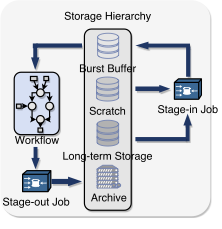
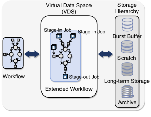

# Summary 

Scientific workflows are processing large amounts of data through
complex simulation and analysis tasks. Meanwhile, the need to minimize
I/O costs on next generation systems and the evolution of new
technologies (NVRAMs, SSDs etc.) is resulting in deeper storage
hierarchies on High Performance Computing (HPC) systems. A
multi-tiered storage hierarchy introduces complexities in workflow and
data management. There is need for simple and flexible data
abstractions that can allow users to seamlessly manage workflow data
and tasks on HPC systems with multiple storage tiers. MaDaTS (Managing
Data on Tiered Storage for Scientific Workflows) provides an API and a
command-line tool that allows users to manage their workflows and data
on tiered storage (@Ghoshal2017).

Traditional Workflow Execution    |  MaDaTS Workflow Execution
:--------------------------------:|:--------------------------------:
  |  

The traditional programming model defines a workflow as a collection
of tasks using data as inputs and outputs. This makes data management
complex on multi-tiered storage systems because the data needs to be
managed explicitly as the workflow tasks execute, ensuring that the
data dependencies and consistencies are handled correctly. MaDaTS is
built on top of an abstraction called **Virtual Data Space** (VDS)
that hides the complexities of managing data on tiered storage systems.
VDS is a collection of virtual data objects. A virtual data object is an
abstraction of workflow data in VDS, associated with certain properties and
tasks. MaDaTS uses these task associations and properties to define
the actual location of data at runtime. In MaDaTS, users simply need
to create the appropriate virtual data objects and add them to a VDS.
MaDaTS takes care of all the data management and workflow execution
tasks. 

Data Management Abstractions
----------------------------
MaDaTS provides a simple data management abstraction through the
**manage()** interface. Users create a VDS and tell MaDaTS to
manage workflow data and tasks. The 'manage' interface also allows
users to group the tasks in different ways. Additionally, users can
select the data management strategy in MaDaTS. By default,
MaDaTS provides three data management strategies -
i) *workflow-aware*: data management decisions are made based on the
structure of the workflow, ii) *storage-aware*: data management decisions
are made based on the storage properties, and iii) *passive*: allows
users to define custom data placement and movement policies.

Users can also define new data management strategies in MaDaTS by
defining data tasks through the **create_data_task()** interface. The
interface adds the necessary data operations needed for efficient
execution of the workflow. Both *workflow-aware* and *storage-aware*
data management strategies use 'create_data_task' to add supplementary
tasks that operate on managing data across the storage tiers. These
data tasks are executed as part of the workflow and are managed through
MaDaTS.

# References